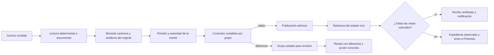

# Automatización financiera de ARAYA

## Objetivo

Permitir que una persona autorizada entregue un documento financiero sin que
el Centro de Control bloquee el expediente completo, manteniendo controles
contables, moneda, periodo, fuente y trazabilidad. Un error afecta únicamente
al grupo de cifras relacionado; el resto del archivo puede publicarse.

## Flujo operativo

## Controles automáticos

- Balance del fideicomiso: `activo = pasivo + patrimonio neto`.
- Patrimonio: `patrimonio bruto + resultado del periodo = patrimonio neto`.
- Resultados mensual y acumulado: `ingresos - gastos = resultado`.
- Balance de comprobación: débitos y créditos iguales y diferencia cero.
- Balance de gestión: activo igual a pasivo más patrimonio.
- Antigüedad de cuentas por pagar: total igual a la suma de tramos.
- Flujo reprogramado: total mensual igual a Urbanismo más Edificios.
- Proyección financiera: neto igual a ingresos menos costes.

Cada control devuelve aprobado, advertencia o bloqueo, junto con la diferencia
calculada. La aprobación manual vuelve a ejecutar las mismas reglas; no existe
un atajo que permita publicar un grupo todavía descuadrado.

## Moneda, corte y autoridad

- La cifra original, su moneda, el tipo USD/DOP, la fecha del tipo y el valor
  canónico quedan en la auditoría de la carga.
- Las claves terminadas en `Dop` se almacenan en DOP y las terminadas en `Usd`
  en USD. La visualización sigue ofreciendo USD por defecto.
- Un corte posterior prevalece sobre uno anterior.
- Para el mismo periodo, una fuente de menor autoridad no sustituye una cifra
  vigente de mayor autoridad. El recibo muestra la decisión tomada.

## Recibo y verificación posterior

El recibo persistente de cada archivo informa de controles, conversiones,
fuente y periodo, cifras antes/después, grupos aislados y pantallas afectadas.
Después de publicar, el sistema relee el estado efectivo y verifica que todas
las claves estén visibles en la misma revisión y con el mismo valor. Si falla,
marca el expediente como observado y avisa a Finanzas y administración.

## Plantillas deterministas

El Centro de datos ofrece plantillas sin cifras vigentes para:

- Balance del fideicomiso.
- Resultados mensual y acumulado.
- Flujo mensual reprogramado.

Se rellena únicamente la columna `valor`. Las plantillas son la vía más rápida
y económica; PDF, Excel, Word, PowerPoint e imágenes continúan admitidos y usan
los lectores o el agente documental según corresponda.

## Operación y pruebas

- Migración: `drizzle/0028_smooth_fantastic_four.sql`.
- Contrato: `lib/financial-governance.ts`.
- Comprobación posterior: `lib/post-publish-verification.ts`.
- Publicación común: `lib/publish-live-data.ts`.
- Pruebas específicas: `tests/financial-governance.test.mjs` y
  `tests/financial-publication-verification.test.mjs`.
- Guía para usuarios: `output/pdf/guia_financiera_araya.pdf`.

Para diagnosticar una carga, abrir su recibo antes de reprocesarla. No modificar
la base directamente: corregir el original o la propuesta aislada conserva la
trazabilidad y permite que la verificación posterior cierre el expediente.
