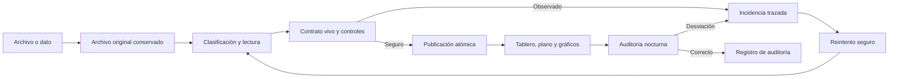

# Automatización operativa de Bricket Control

Actualizado: 22/08/2026

## Objetivo

Reducir trabajo manual sin rebajar los controles de autoridad, privacidad ni
cuadre financiero. Las tareas deterministas no usan IA: auditoría, cierres,
recordatorios, reintentos, notificaciones, copias y restauraciones se ejecutan
con reglas de código y quedan registradas.

## Automatizaciones activas

1. **Auditoría diaria**: verifica el contrato de todos los puntos vivos,
   controles financieros y cargas detenidas. Genera incidencias idempotentes,
   reintenta solo expedientes seguros y resuelve automáticamente una incidencia
   cuando deja de reproducirse.
2. **Cierre semanal y mensual**: crea periodos y requisitos por área, asigna el
   responsable disponible, detecta el documento recibido y evita cerrar con
   entregables obligatorios pendientes.
3. **Carga múltiple y compartir**: admite hasta 20 originales por lote. Cada
   documento se procesa por separado y conserva recibo propio. En una PWA
   instalada, el menú Compartir del dispositivo entrega los archivos a una
   bandeja IndexedDB y abre el formulario de carga.
4. **Centro de incidencias**: muestra severidad, área, archivo, responsable e
   intentos. El administrador puede reintentar o resolver con trazabilidad.
5. **Avisos configurables**: cada usuario elige áreas, solo críticos, horario
   silencioso en su hora local, avisos inmediatos o resumen diario/semanal.
   Silenciar el push no elimina el aviso interno.
6. **Copia y restauración**: GitHub Actions exporta D1 cada día, restaura el SQL
   en una base temporal, ejecuta `PRAGMA integrity_check`, conserva 30 días de
   artefactos versionados y actualiza una copia `latest` protegida en R2.
7. **Onboarding**: un recorrido de siete pantallas explica navegación, cargas,
   recibos, automatización, avisos y ayuda. El progreso se guarda por usuario.

## Operación y secretos

Los workflows necesitan los secretos existentes del repositorio:

- `DEPLOY_VERIFY_EMAIL` y `DEPLOY_VERIFY_PIN` para las acciones autenticadas.
- `CLOUDFLARE_API_TOKEN` y `CLOUDFLARE_ACCOUNT_ID` para D1 y R2.

Workflows:

- `.github/workflows/auditoria-nocturna.yml`: 12:17 UTC cada día.
- `.github/workflows/backup-produccion.yml`: 04:43 UTC cada día.

Ambos también admiten ejecución manual desde GitHub Actions. Las claves nunca se
guardan en el repositorio ni se envían al navegador.

## Comprobación operativa

- Abrir **Datos - Centro de datos - Automatización** y comprobar la última
  auditoría, incidencias activas, periodos y copia verificada.
- Ejecutar **Comprobar ahora** como administrador tras una migración relevante.
- No cerrar un periodo hasta que todos los requisitos obligatorios figuren como
  recibidos.
- Ante un fallo de copia, descargar el último artefacto correcto de GitHub,
  probarlo en una base temporal y restaurar únicamente mediante el procedimiento
  de recuperación aprobado.

## Criterios de seguridad

- La autorreparación nunca aprueba una cifra financiera ni altera la jerarquía
  de fuentes: solo vuelve a ejecutar el lector y los mismos controles.
- Los datos financieros y comerciales se filtran antes de responder al usuario.
- Las tareas usan claves idempotentes para evitar auditorías, resúmenes o copias
  duplicadas del mismo periodo.
- El bucket R2 conserva una sola copia `latest`; la retención versionada de 30
  días vive en GitHub Actions para evitar almacenamiento sin límite.
